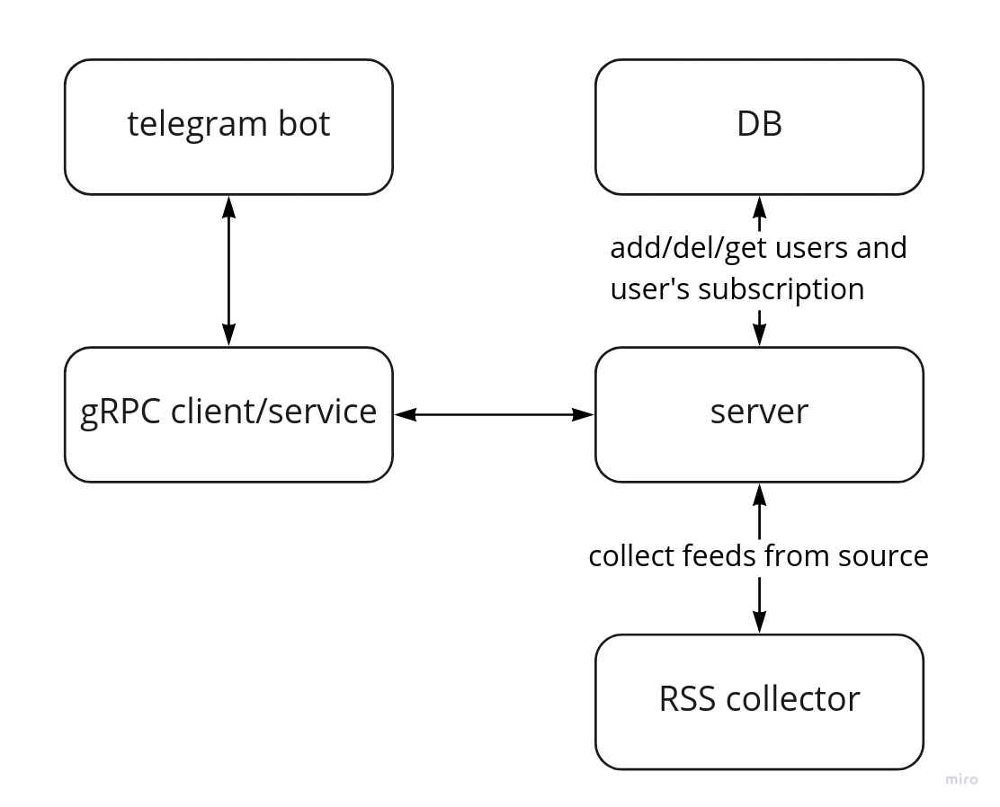

# homework-2

Телеграм бот который присылает обновления из RSS фидов на которые подписался пользователь. С возможностью редактировать список источников. Рассылка производится по расписанию один раз в час.

### Схема архитектуры приложения:

